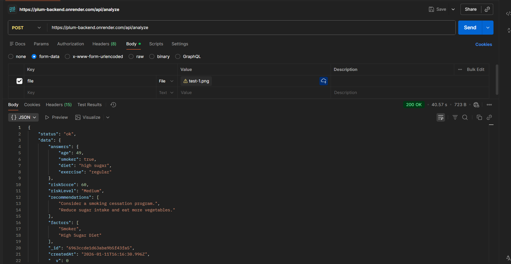
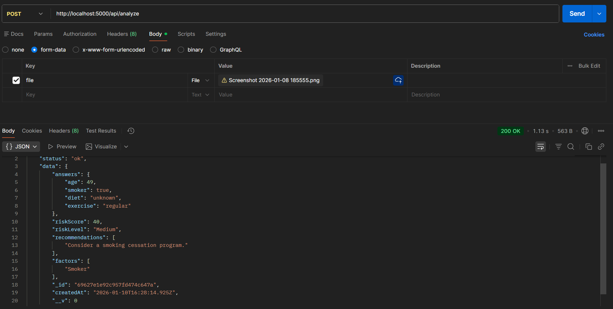

# 🏥 AI Health Risk Profiler

Backend url:-https://plum-backend.onrender.com
Testing Images:-assets folder

A robust backend service that analyzes health survey forms (both scanned images and text input) to assess health risks using OCR and a Rule-Based Inference Engine.


## 🚀 Features
* **Multi-Modal Input:** Accepts scanned images (via Tesseract OCR) or direct JSON/Text input.
* **Rule-Based AI:** Uses a deterministic Expert System to calculate risk scores, ensuring 100% consistent and safe medical recommendations.
* **Guardrails:** Automatically rejects submissions with >50% missing data to prevent unsafe assumptions.
* **Data Persistence:** Stores all profiles in MongoDB for future retrieval.

## 🛠️ Tech Stack
* **Backend:** Node.js, Express.js
* **AI/OCR:** Tesseract.js (LSTM Neural Net for Vision)
* **Database:** MongoDB (Mongoose)
* **Frontend:** React (Vite)

## ⚙️ Setup & Installation

1.  **Clone the Repository**
    ```bash
    git clone <your-repo-link>
    cd health-risk-profiler
    ```

2.  **Backend Setup**
    ```bash
    cd backend
    npm install
    # Create a .env file:
    # MONGO_URI=mongodb://localhost:27017/health-app
    # PORT=5000
    node server.js
    ```


## 📡 API Usage

### `POST /api/analyze`
Accepts `multipart/form-data` with an image file OR JSON text.

**Request (Text):**

## 🧪 API Testing
Here is the proof of the API working in Postman:



